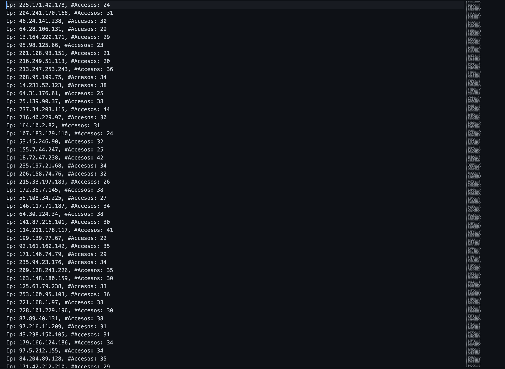
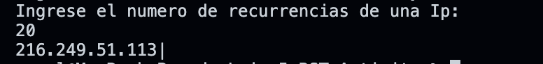

#   BST Activity 

## Description
This activity was part of the subject "Data Structures and Fundamental Algorithms" where I was asked to implement the main functionality of a BST data structure and use it to order data from a file. 

## Main Learnings 
* Queue
* Lists (Simple Linked, Double Linked)
* Search Algorithms (DFS, BFS)
* Binary Search Tree (BST)
* Read and Write in Files

## Installation
* Make sure to have installed a C++ enviroment 
* Download the repository on your local machine
* Run the command <code>./main</code> on the terminal located at the root path of the project or just open the <code>main.exe</code> file

## Screenshots
 
